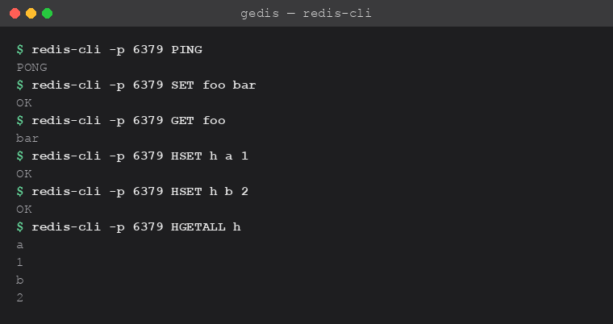
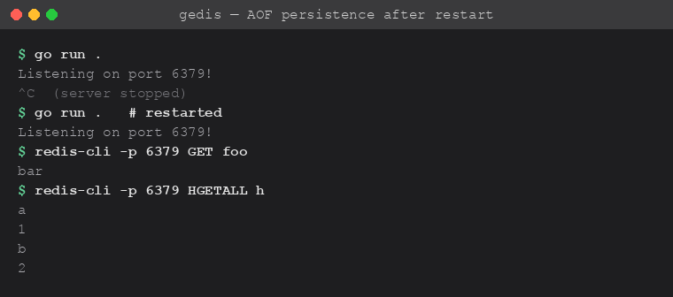

# Gedis

A minimal, in-mem database written in Go, speaking the Redis protocol.

Built from scratch as a way to understand databases and what goes on underneath the API (how data is parsed, held in memory, written to disk)

## Status
Learning project and not production software.

## Features

- **RESP protocol** -> parses and serializes the Redis Serialization Protocol, so any client can talk to it
- **Concurrent connections** -> one go-routine per client
- **Commands** -> `PING`, `SET`, `GET`, `HSET`, `HGET`, `HGETALL`
- **Persistence** -> Append Only File (AOF) written on every write and replayed on startup

## Usage

Run the server with `go run .`, then talk to it with any Redis client, e.g. `redis-cli -p 6379`:

Data written to the AOF survives a restart -> kill the process, run `go run .` again, and the keys are still there:

## License

MIT